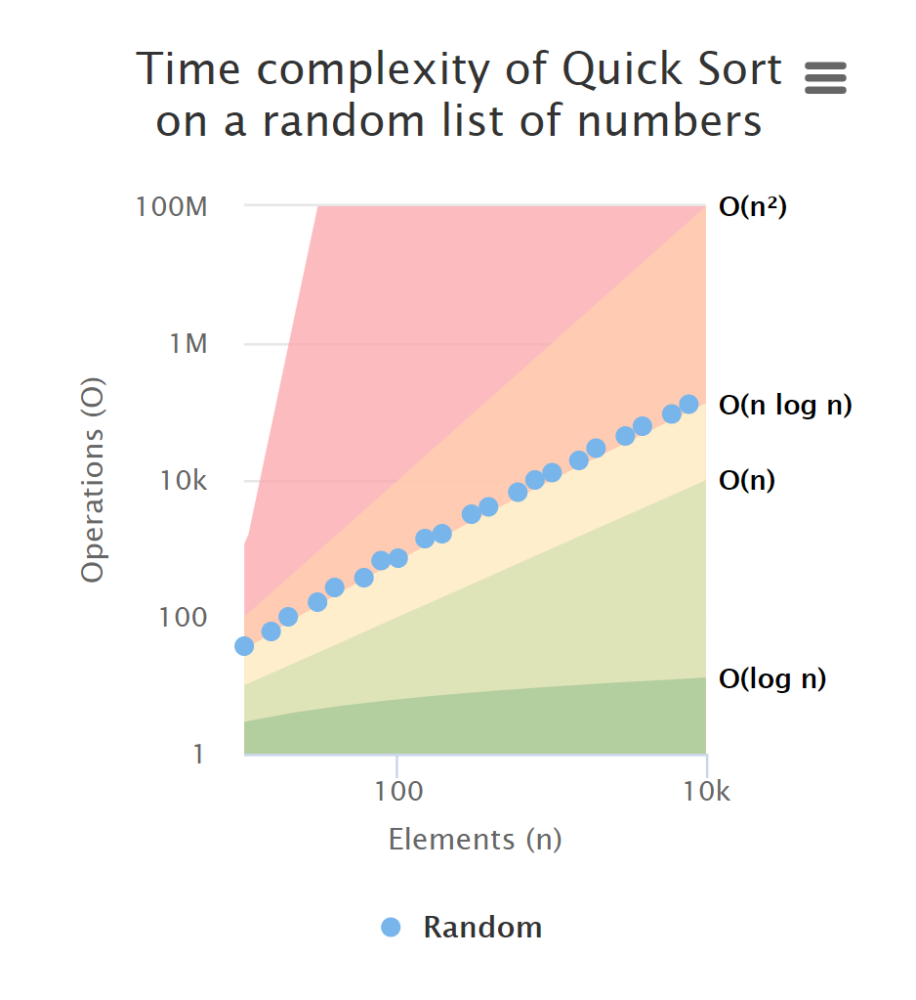
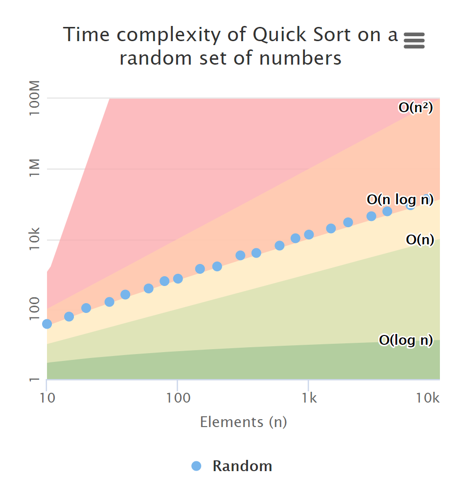

This week I've been working on the *polish* of this project. No, I'm not translating the website to the Polish language (sorry Poland!), but:

> pol·ish (verb) make the surface of (something) smooth and shiny by rubbing it.

A.k.a. just raising the bar on things. Whether I'm working on a multi-million user international product or my own little pet project, I like to use my own products every day. I wake up with them and I go to bed with them. And even though I've looked at the same screen every day for the last thirty days... sometimes I can just wake up, open that same screen I've been staring at for ages and think:

<Text sx={{ textAlign: "center", fontSize: [3, 3, 5], lineHeight: "loose" }}>
No.<br/>
This doesn't look right.<br/>
Has this always been like this?<br/>
This won't do.<br/>
I have to change this <strong>immediately</strong>.
</Text>

I had a moment like this a couple of days ago when I opened the Big O Visualizer on my smartphone, looked at the charts and thought:

<Text sx={{ textAlign: "center", fontSize: [3, 3, 5], lineHeight: "loose" }}>
Ugh...
</Text>

My biggest peeve was that the whole thing just looked constrained and awkward on a smaller viewport. I wondered if it was feasible to cram this much information in such a small space. I mean, whenever I see a big news website embed charts in their articles they don't work that well on my smartphone (iPhone XS for those wondering). Can this be improved? Or are responsive charts like responsive tables: doomed to fail.

And thus I scurried to my desk in my bathrobe and started taking the thing apart.

### Highcharts Responsive versus React Responsive

Initially, I tried to use [Highchart's own Responsive functionality](https://www.highcharts.com/docs/chart-concepts/responsive), which was recently introduced in their 5.0 release. Unfortunately, this [didn't play well](https://github.com/whawker/react-jsx-highcharts/issues/284) with [react-jsx-highcharts](https://github.com/whawker/react-jsx-highcharts), the React plugin I'm using to integrate Highcharts into this project.

However, the React ecosystem is home to the excellent [react-responsive](https://github.com/contra/react-responsive) plugin by [Eric Schoffstall](https://contra.io/). This plugin introduces the `useMediaQuery` Hook, which allows me to do delicious things like:

```ts:title=src/components/complexity-chart.tsx {3-7,22}
const ComplexityChart = ({ title, children }: ComplexityChartProps) => {
  const { theme } = useThemeUI()
  const isDesktop = useMediaQuery({ minDeviceWidth: theme.breakpoints?.[0] as string })
  const yAxisLabels = isDesktop ? { rotation: 0, padding: 5, x: -8 } : { rotation: -90, padding: 0, x: -3 }
  const titleStyle = isDesktop ? { fontSize: theme.fontSizes?.[2] } : { fontSize: theme.fontSizes?.[1] }
  const chartMarginRight = isDesktop ? 70 : 0
  const chartSpacing = isDesktop ? [10, 10, 15, 10] : [10, 5, 15, 5]
  const [colorMode] = useColorMode()
  const isDark = colorMode === `dark`

  return (
    <HighchartsChart plotOptions={plotOptions} callback={setTheme} key={colorMode} sx={{ backgroundColor: "chart" }}>
      <Chart marginRight={chartMarginRight} spacing={chartSpacing} zoomType="xy" backgroundColor="transparent" />
      <Title style={titleStyle}>{title}</Title>
      <Loading>Running analysis...</Loading>
      <Legend />
      <Tooltip />
      <XAxis type="logarithmic" min={10} max={10000}>
        <XAxis.Title>Elements (n)</XAxis.Title>
      </XAxis>
      <YAxis type="logarithmic" min={10} max={100000000} labels={yAxisLabels}>
        {isDesktop && <YAxis.Title>Operations (O)</YAxis.Title>}
        {children}
      </YAxis>
    </HighchartsChart>
  )
}
```

The lines of interest are highlighted. Below an explanation per line:

* Line 3. Create a fresh `useMediaQuery` Hook using the desktop breakpoint from [the current theme](https://github.com/system-ui/theme-ui/blob/master/packages/preset-tailwind/src/index.ts#L12).
* Line 4. Render the Y-axis labels normally on desktop and 90 degrees rotated on mobile. This reduces the width of the Y-axis on mobile, so there's more space left for the chart.
* Line 5. Match the font-size of the title with the rest of the site. This is just to keep things consistent with the theme, which uses a larger font size on desktop than on mobile.
* Line 6. Reserve some whitespace to the right of the chart on desktop to render the labels. On desktop, we will keep the complexity labels out of the chart area, but on mobile we're going to pull those in.
* Line 7. Give the chart some more space on desktop.
* Line 22. Render the title of the YAxis *only* on desktop. This powerful feature of the `useMediaQuery` Hook allows you to conditionally render any React component given a media query. Cool stuff.

The ComplexitySeries component is changed so that the complexity labels are pulled inside the chart area on mobile. Again, we use `useMediaQuery` to achieve this behavior:

```ts:title=src/components/complexity-series.tsx {3,20,21,24}
const ComplexitySeries = () => {
  const { theme } = useThemeUI()
  const isDesktop = useMediaQuery({ minDeviceWidth: theme.breakpoints?.[0] as string })
  const plotOptions = {
    lineWidth: 0,
    marker: {
      enabled: false,
    },
    states: {
      hover: {
        lineWidth: 0,
      },
    },
    enableMouseTracking: false,
    showInLegend: false,
    dataLabels: {
      enabled: false,
      crop: false,
      allowOverlap: true,
      overflow: isDesktop ? "allow" : "justify",
      align: isDesktop ? "left" : "center",
      verticalAlign: "middle",
      format: `{series.userOptions.notation}`,
      x: isDesktop ? 0 : 5,
    },
  }
  const xPoints = Array.from({ length: 42 }, (v, i) => Math.min(10000, 2 ** i / 3))
  const complexitySeries = Complexities.common.map((r) => (
    <AreaSeries
      key={r.name}
      name={r.name}
      color={getColorForComplexity(theme, r)}
      notation={r.notation}
      data={xPoints.map((x) => ({ x, y: r.calculate(x) }))}
      {...plotOptions}
    />
  ))
  complexitySeries.forEach((x) =>
    Object.assign(x.props.data[x.props.data.length - 1], { dataLabels: { enabled: true } })
  )
  return complexitySeries
}
```

That's it! Just four lines of code were changed to introduce this behavior.

### The result

So what does this get us? See the below before and after:

<div style="display: flex; justify-content: space-evenly; flex-wrap: wrap; ">
    <div style="max-width: 375px; flex: 1 0 325px;">
        
    </div>
    <div style="max-width: 375px; flex: 1 0 325px;">
        
    </div>
</div>

Not bad. 👍

